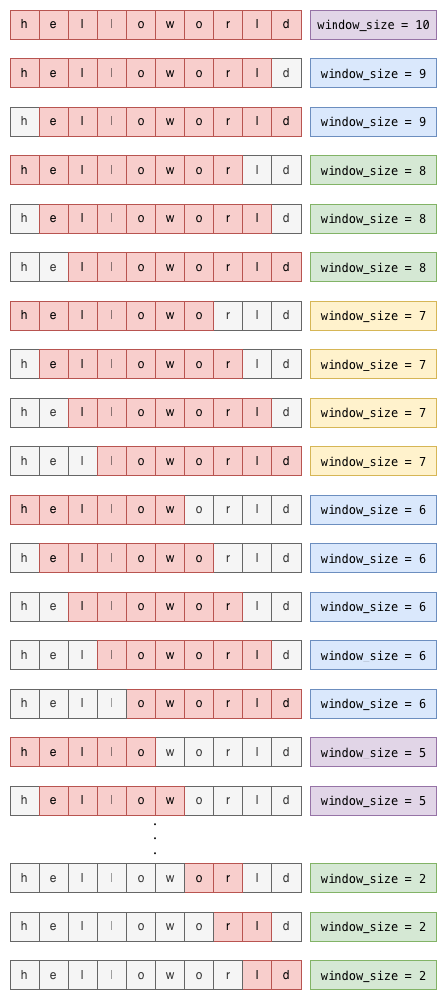

## Decrementing Sliding Window in Java

### Why I'm creating this

I was doing this coding test but fumbled and couldn't figure out how to implement a decrementing sliding window in Java.
This component was crucial for the assignment (I can't disclose the full content of the task though).

Also, I couldn't find any reference online, so I'd like to leave this here for anyone who'd like to leverage it.

### How it works

The first window generated by the algorithm will be of the same size as reference_string. Afterwards, the window size will decrement by 1 and slide across reference_string.
The algorithm will iterate by sliding the window across reference_string by each character, then shrink the window by 1 until its size reaches 2.

### Algorithm illustration

